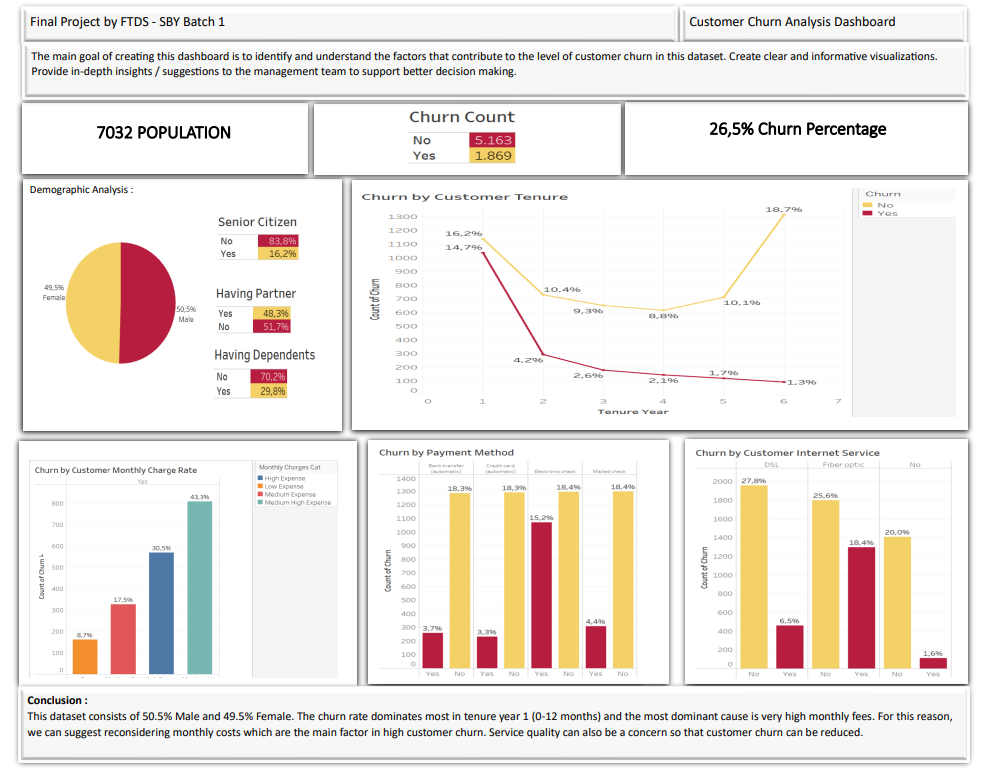
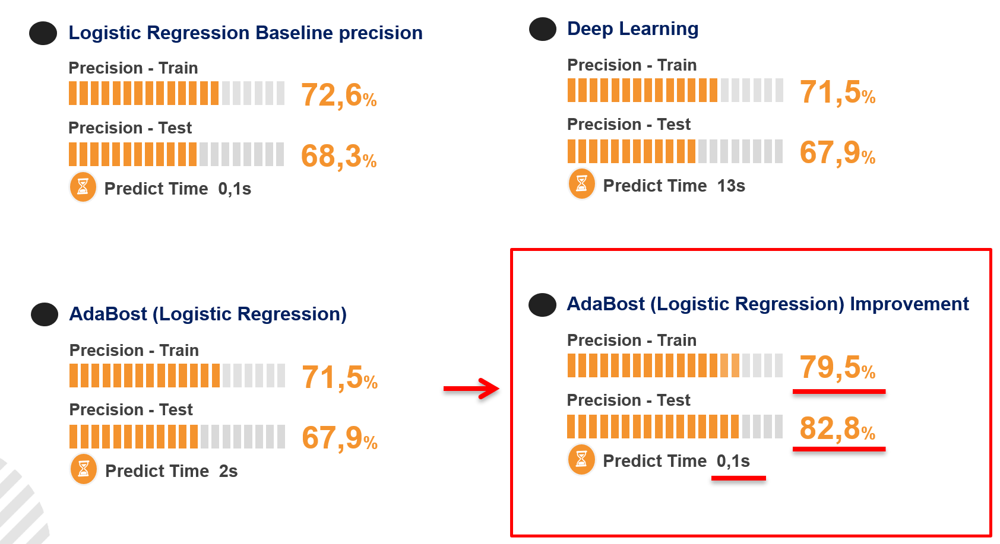
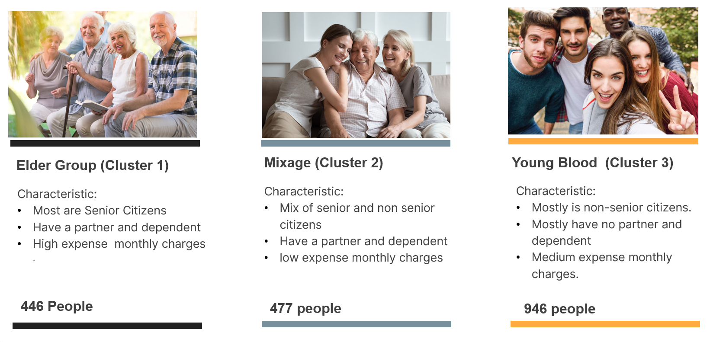

<!--  -->

# Telco Customer Churn and Segmentation
This repository contains an supervised and unsupervised machine learning to predict whether customers unsubscribe or not and then create a customer segmentation to retain customer. The project is designed to help the Telco company to predict customer churn and retain its customer.
<!-- Telecommunications industry being highly competitive, faces challenges in retaining customers. Churn, or customer attrition, is a critical metric that directly impacts the revenue and growth of a Telco company. -->

## Project Overview
Telco Customer Churn and Segmentation project aims to predict whether customers unsubscribe or not using `Classification Algorithm` and then create a customer segmentation to retain customer using `K-means algorithm`. By analyzing the customer subscription data history, the project can help Telco Company to understand the factors contributing to customer churn in, enabling data-driven strategies to reduce churn ra tes and enhance customer retention.

## Tools and Technologies
- Python
- Apache Airflow
- PostgreSQL
- Jupyter Notebook
- Pandas
- Matplotlib
- Seaborn
- Tableau
- Scikit-learn
- Tensorflow
- Keras
- Streamlit

## File Description
- `airflow/airflow_DAG.py` : Airflow DAGs containing the code to extract data from database, perform data cleaning and save clean data.
- `model_development/*.ipynb` : Jupyter Notebook file containing code for data exploration, visualization, machine learning and deep learning.
- `model_development/*.csv` : CSV file containing various kinds of data of Telco Customer transaction.
- `images/` : Folder containing images of data visualization, analysis result and logo of this project.
- `pickle/` : Folder containing compile result of model developement, used for model deployment.
- `deployment/` : Folder containing python code for model deployment.
- `presentation/` : Folder containing dashboard and slide for this project.
- `deplyment_url.txt` : Text file containing link to our application.

## Exploratory Data Analysis
<!-- --- -->

Based on the EDA we found several column that have high correlation with customer churn. This column is Senior Citizen, Having Dependents, Tenure, Monthly Charge, Payment Method and Internet Service. Next we will use this column to create a classification model.

## Result
### Classification Result

We use several algorithm for this project and above are the best result we got. We use `AdaBoost` algorithm to boosting `LogisticRegression` algorithm, then we do hyper parameter tuning for this `AdaBoost` and got the best result. To analyze this model, we use `precision` metrics because we want to maximize the model to correctly predict churn customer. As a result we got 79.5% precision score on train-set and 82.8% on test-set and this result can be called `goodfit`.

### Clustering Result

From the classification result, we do customer segmentation using `K-means` algorithm and above are the result. We successfully separate these churn customer into three segment. Each segment has their own characteristic. Then based on this characteristic, we give few suggestion for marketing team to provide offers to these customers to retain them. The following are our suggestions :
#### Elder Group
- Offers long term packages
- Give limited time offer
- Maintain good communication with this customer

#### Mixage
- Provides offers with many benefits if they subscribe for the long term
- Offers annual DSL internet packages at affordable prices
- New customer onboarding and orientation

#### Young Blood
- Make an affordable internet package prices for this cluster
- Provides variation in Payment Method

## Conclusion
From all three segment show similarities in having a short average tenure, indicating a trend for customers to end service relatively quickly. Fiber optic internet service was a common factor among the clusters, indicating that this service may have issues that lead to customer dissatisfaction.

## Overall Suggestion
- Always improve service quality and maintain open communication with customers.
- Consider a loyalty program or incentives for loyal customers.
- Monitor and respond to customer feedback regularly.
- Adjust marketing strategies and offers based on the characteristics of each cluster.
- Strengthen customer service to provide effective and responsive support.

## Our Team
- Gilang Wiradhyaksa | [Linkedin](https://www.linkedin.com/in/gilangwiradhyaksa/) | [GitHub](https://github.com/gilangwd)  
- Joshua Osaze Kurniawan | [Linkedin](https://www.linkedin.com/in/joshua-osaze-kurniawan-45560228a/) | [GitHub](https://github.com/JoshuaOsazeKurniawan)  
- Stephanus Adinata Susanto | [Linkedin](https://www.linkedin.com/in/stephanus-adinata-susanto-1b115b170/) | [GitHub](https://github.com/StephanusAdinata)  
- Samuel Christian Soendjojo | [Linkedin](https://www.linkedin.com/in/samchriss94/) | [GitHub](https://github.com/samchriss94)  

## Acknowledgements
The Telco Transaction data used in this project was obtained from [Kaggle](https://www.kaggle.com/datasets/blastchar/telco-customer-churn/)

Model Deployment for this project on [Hugging Face](https://huggingface.co/spaces/gilangw/ChurnDefender)